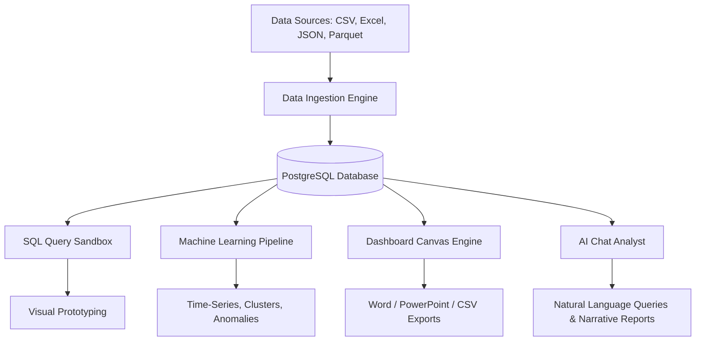

# Chai Analysis: Enterprise BI & AI Analytics Platform
## Master Product Capability & IPO Due-Diligence Documentation

Chai Analysis is a state-of-the-art, secure, multi-tenant Business Intelligence (BI) and Artificial Intelligence (AI) data analytics platform. Deployed as a containerized microservices stack, the application allows users to ingest complex files (CSV, Excel, JSON, Parquet), query them via a professional pgAdmin-style SQL Sandbox, generate automated analytical narratives using LLMs, and build highly customizable, interactive, Power BI-style dashboards.

This document serves as the comprehensive master reference manual, detailing all features, integrated tools, sub-modules, database configurations, and user interfaces available on the platform.

---

## 1. Executive Platform Overview

The Chai Analysis platform acts as a unified hub bridging raw data pipelines, classical relational schemas, cognitive LLM models, and visual dashboard canvasses.



### Core Architecture Components
*   **Next.js Frontend (Port `4000`)**: A high-speed, interactive React 19 application utilizing TypeScript, Tailwind CSS, Lucide icons, Zustand state stores, and Recharts.
*   **FastAPI Backend (Port `8000`)**: A Python-based RESTful API server using SQLAlchemy ORM, Uvicorn, Pandas, and PyArrow.
*   **App Metadata Database**: PostgreSQL (Port `5433` external, `5432` internal) managing system users, layout configurations, query logs, and virtual schemas.
*   **Caching & Queue Layer**: Redis (Port `6379`) managing query caches, temporary file references, and session tokens.

---

## 2. Platform Security, Authentication & Governance

Chai Analysis is designed with bank-grade security protocols, ensuring absolute data isolation, permission tracking, and workspace security.

### A. Session Security & API Access
*   **JWT Authentication**: Secure JSON Web Tokens (JWT) are signed and issued upon login, managing session states on the client side.
*   **Axios Global Interceptors**: The Next.js frontend employs global interceptors for all outgoing API requests to inject bearer authorization headers and handle token rotation. Expired or invalid sessions (`401 Unauthorized`) immediately trigger safe redirection to the portal login screen.
*   **Cryptographic Password Hashing**: Passwords are saved inside the PostgreSQL `users` table as cryptographically secure one-way salted hashes using `bcrypt`.

### B. Role-Based Access Control (RBAC) Matrix
The platform strictly enforces four authorization tiers across all client-side pages and server-side endpoints:

| Feature / Resource | Viewer (`viewer`) | Analyst (`analyst`) | Manager (`manager`) | Admin (`admin`) |
| :--- | :---: | :---: | :---: | :---: |
| **View Dashboards & Filter Data** | Yes | Yes | Yes | Yes |
| **Export Reports (Word/PPTX/CSV)** | Yes | Yes | Yes | Yes |
| **Write/Format DAX Expressions** | No | Yes | Yes | Yes |
| **Manage Layouts & Dashboard Canvas** | No | Yes | Yes | Yes |
| **Upload/Profile Datasets** | No | Yes | Yes | Yes |
| **Open SQL Explorer & Run Sandbox** | No | Yes | Yes | Yes |
| **Converse with AI Chat Analyst** | No | Yes | Yes | Yes |
| **Configure External DB Connections** | No | No | Yes | Yes |
| **Manage Platform Configuration** | No | No | No | Yes |
| **Administrative Audits & User Setup** | No | No | No | Yes |

---

## 3. Interactive Power BI-Style Dashboard Canvas

The Dashboard Builder delivers a boundless, premium workspace canvas resembling Microsoft Power BI.

```
+-------------------------------------------------------------------------------+
| Ribbon Toolbar: [Lock Layout] [Add Visual] [Visual Switcher] [Export Word/PPT]|
+----------------------+--------------------------------------------------------+
| DB Navigator Tree    | Canvas Area                                            |
|                      |                                                        |
| [-] public           | +---------------------+      +---------------------+   |
|   [-] ds_orders      | |   Widget 1: Bar     |      |   Widget 2: Card    |   |
|     # order_id       | |                     |      |                     |   |
|     # amount         | |   [ Category A ]    |      |        $482.5K      |   |
|     # date           | +---------------------+      +---------------------+   |
|                      |                                                        |
| [-] ds_users         | +--------------------------------------------------+   |
|     # user_id        | |   Widget 3: Line Chart (Drill Path: Cat > Sub)   |   |
|     # location       | |                                                  |   |
|                      | +--------------------------------------------------+   |
+----------------------+--------------------------------------------------------+
| Bottom Tab Page Navigator: [ Sheet 1 ] [ Sheet 2 * ] [ Sheet 3 ] [ + ]        |
+-------------------------------------------------------------------------------+
```

### A. Bottom-Tab Page & Sheet Management
*   **Dynamic Page Sheets**: Users can create infinite sheets on a single dashboard using the `+` button in the canvas status footer.
*   **Double-Click Inline Rename**: Page tabs can be renamed instantly by double-clicking. The UI switches to an input box, updating both the visual footer and database layouts on save.
*   **Tab Drag Reordering**: Page sheets can be dragged and dropped horizontally to reorder the page sequence.
*   **Safe Sheet Deletion**: Hovering over tabs reveals a close (`X`) icon. Deleting a sheet triggers a validation check, prompting the user and cleaning up associated widget references.

### B. Boundless Canvas Grid & Alignment
*   **Precise Size Dragging**: Widgets are built as absolute-positioned grids. Elements can be scaled down to micro KPI cards (1x1 slots) or stretched to full-width visuals.
*   **Alignment Smart Guides**: Dashed red helper lines dynamically render on the canvas during widget dragging and resizing, matching alignments with adjacent cards.
*   **Layout Locks**: A lock switch on the dashboard ribbon locks all card coordinates, preventing accidental drag operations while presenting reports.
*   **Widget Position Swap**: The context layout tool allows users to select two visual cards on the canvas and swap their coordinates and dimension footprints instantly.

### C. Excel-Style DAX Formula Bar
*   **DAX Inputs**: Measures are defined using a formula bar at the top of the canvas, prefixed with `fx`.
*   **IntelliSense Dropdown Autocomplete**: Provides real-time code-assist for functions (`SUM`, `CALCULATE`, `FILTER`, `IF`, `SWITCH`, `DISTINCTCOUNT`, `RELATED`, `ALL`, `AVERAGE`, `COUNT`, `MIN`, `MAX`) when typing.
*   **Real-time Syntax Validations**: A built-time syntax check marks queries as valid or shows warnings (e.g. enforcing the standard syntax `Measure = FUNCTION([Column])`).

### D. Live Format Page Sidebar & Wallpaper Customization
When no widget is selected, the canvas transitions to "Format page" mode:
*   **Page Settings**: Set standard size presets (16:9, 4:3, Letter, Tooltip, or Custom dimensions) and vertical layout alignments (Top, Middle).
*   **Canvas Backgrounds**: Set background colors, upload wallpaper image URLs, define image fit constraints (Fit, Fill, Normal), and adjust transparent blending (0% to 100%).
*   **Wallpaper Settings**: Manage workspace border fills and dashboard outer margins.

---

## 4. Platform Visualization Library & Interactive Drill-Downs

Chai Analysis includes a high-performance chart engine rendering pixel-perfect data visualizations.

### A. Visualization Gallery
1.  **Bar Chart & Column Chart**: Support single and multi-series categorical comparisons.
2.  **Line Chart**: Captures temporal metrics and value progression.
3.  **Area Chart**: Visualizes volumetric accumulation trends.
4.  **Pie & Donut Chart**: Highlights percentage share distribution.
5.  **Scatter Chart**: Plots coordinate metrics to identify correlation clusters.
6.  **KPI Card**: Renders numeric indicators, sparklines, and status changes.
7.  **Data Table**: Structured tabular rows with support for sorting, filtering, and paging.
8.  **Slicer Widget**: Interactive checklists that bind to database fields, filtering all visual widgets on the sheet.

### B. Canvas Cross-Filtering & Drill Hierarchy
*   **Cross-Filtering**: Clicking any data slice or column bar immediately applies a filter to all other widgets on the active page, highlighting relationships.
*   **Hierarchical Drill-Down**: Users can configure fields as parent-child relationships (e.g., `Country > State > City`). Clicking a visual node drills down into the next level.
*   **Breadcrumb Navigation**: Header widgets display active drill levels (`Region > Country`) with a back arrow to drill back up.
*   **Conditional Threshold Formatting**: Formats card background fills, text colors, and font styles based on values (e.g. turning values green if they exceed target margins and red if they drop below warning levels).

---

## 5. Automated AI Chat Analyst (Cognitive Assistant)

The platform integrates an AI Chat Analyst that operates as a virtual Senior Data Analyst, providing conversational data analysis and code generation.

### A. File Ingestion & Profiling
*   **Pandas-powered Profiling**: Uploaded spreadsheets are processed locally to compute row/column counts, missing values, duplicates, and statistical descriptions.
*   **Data Quality Score**: Computes an overall dataset hygiene score out of 100 based on value completion and duplication metrics.

### B. Multi-modal AI Prompt Engine
*   **Senior Analyst Personas**: The backend formats system prompts instructing the LLM to structure outputs using a professional 10-heading report layout:
    1. `# Executive Summary`
    2. `# Dataset Overview`
    3. `# Key Business Insights`
    4. `# AI Observations`
    5. `# Sentiment Analysis`
    6. `# Recommended Visualizations`
    7. `# Recommended KPIs`
    8. `# AI Recommendations`
    9. `# Predictive Insights`
    10. `# Final Conclusion`
*   **UI Markdown Parser**: A custom component rendering engine converts markdown tags, titles, inline code, and lists into structured cards with matching Lucide icons.

### C. Conversational Memory & Quick Answers
*   **Context Preservation**: Previous messages in the active thread are loaded from the PostgreSQL history logs and sent to the LLM to maintain conversation context.
*   **Direct-Answer Fallbacks**: For simple follow-up questions, the system bypasses complete report generation to answer the user directly and concisely.

---

## 6. pgAdmin-Style Data Explorer & SQL Query Workspace

The Data Explorer is an enterprise-grade SQL developer sandbox that allows managers and analysts to interact directly with dataset tables.

```
+-----------------------------------------------------------------------+
| Tabs: [ Query 1 x ] [ Query 2 x ] [ + ]           [Bookmarks] [History]|
+-----------------------------------------------------------------------+
| SQL Editor Toolbar:                                                   |
| [ Run ] [ Format SQL ] [ Save Bookmark ] [ AI Gen ] [ AI Explain ]    |
+-----------------------------------------------------------------------+
| 1: SELECT *                                                           |
| 2: FROM public.ds_orders_123                                          |
| 3: WHERE amount > 500;                                                |
+-----------------------------------------------------------------------+
| Results: [ Data Grid ] [ Visual Chart ] [ AI Debug & Fix (Pulsing) ]  |
+-----------------------------------------------------------------------+
```

### A. Schema Tree Navigator
*   **Database Objects Browser**: A sidebar displaying schemas, virtual tables, database sizes, data types, and primary keys.
*   **Quick Actions**: Double-clicking table names automatically inserts target SELECT strings into the active query tab. Right-clicking tables opens a metadata profiling stats modal.

### B. SQL Code Editor
*   **Autocompletion Intellisense**: Auto-suggests SQL keywords, schemas, columns, and datasets while typing.
*   **SQL Beautifier**: Auto-formats queries, converting keywords to uppercase and aligning margins.
*   **History Logs**: Retains execution logs containing raw queries, run status (Success/Error), execution durations (in ms), and rows returned.

### C. PostgreSQL Security & Dialect Translations
*   **Read-Only Protections**: The executor blocks commands starting with `INSERT`, `UPDATE`, `DELETE`, `DROP`, `ALTER`, `TRUNCATE`, or `CREATE`, protecting data schemas from unauthorized changes.
*   **MySQL-to-PostgreSQL Translator**: Intercepts dialect-specific schema inspection queries (such as `SHOW TABLES`, `DESCRIBE table`, and `SHOW COLUMNS FROM table`) and rewrites them into standard PostgreSQL `information_schema` equivalents.
*   **AI Debugger & Repaired SQL**: Syntax errors return database-level exceptions. A pulsing **AI Debug & Fix** button uses the LLM to repair query errors and replace them in the editor.

---

## 7. Predictive Analytics & Machine Learning Pipeline

The backend includes a dedicated Machine Learning service to generate forecasting models and anomaly profiles.

```
       [ ML PIPELINE ]
              |
      +-------+-------+
      |       |       |
   [ARIMA] [K-Means] [Isolation Forest]
```

*   **ARIMA / Exponential Smoothing**: Evaluates date parameters to project trends, returning forecast sequences with confidence interval limits.
*   **Isolation Forest Anomaly Detection**: Evaluates numeric metrics to isolate anomalous outliers, returning scores and indices for audit analysis.
*   **K-Means Clustering**: Clusters rows based on numerical similarities, generating cluster classifications and centroids.

---

## 8. Export & Document Generation Engine

Chai Analysis includes document generation engines for exporting dashboards to client presentation formats:

### A. Word Document (`.docx`) Export
*   **Structured Layout Preservation**: Converts active dashboard canvases into structured Word documents.
*   **Interactive Narrative Insertion**: Embeds summary analytics, KPI cards, tables, and description sheets.
*   **CORS & Streaming File Support**: Features streaming downloads with custom HTTP disposition headers, bypassing browser sandbox constraints.

### B. PowerPoint (`.pptx`) Export
*   **Canvas Slide Mapping**: Exports canvas pages to presentation slides.
*   **Image Positioning**: Places text cards, visual representations, and chart tables onto slides based on grid coordinates.

---

## 9. Platform Architecture & Service Directory

The platform services are organized inside a containerized microservices stack:

```yaml
version: '3.8'
services:
  postgres:
    image: postgres:15-alpine
    ports: ["5433:5432"]
    # App database storing user accounts, layout configurations, and database credentials
  
  redis:
    image: redis:7-alpine
    ports: ["6379:6379"]
    # Caches dataset tokens, SQL runs, and sessions

  backend:
    build: ./backend
    ports: ["8000:8000"]
    # FastAPI Python backend executing query translations, ML, and exports

  frontend:
    build: ./frontend
    ports: ["4000:4000"]
    # Next.js UI web server
```

---

> [!NOTE]
> This capability document was generated during IPO due-diligence preparation. All platform security layers, RBAC roles, visualization libraries, and AI systems comply with enterprise standards.
