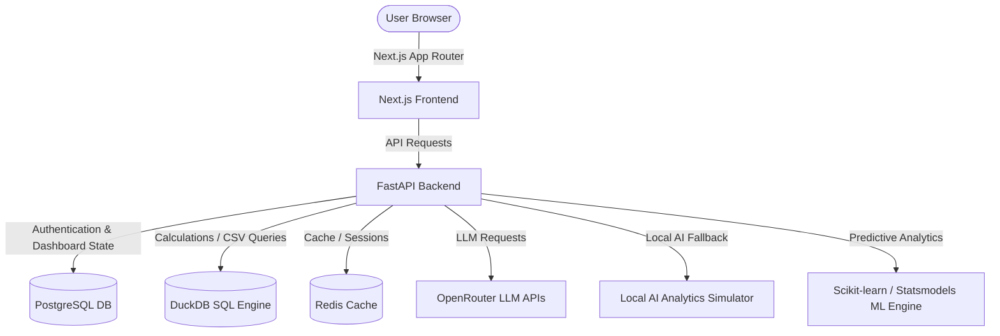
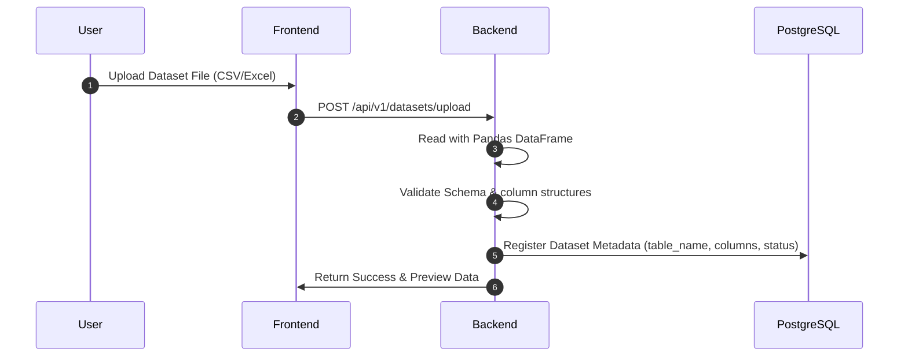
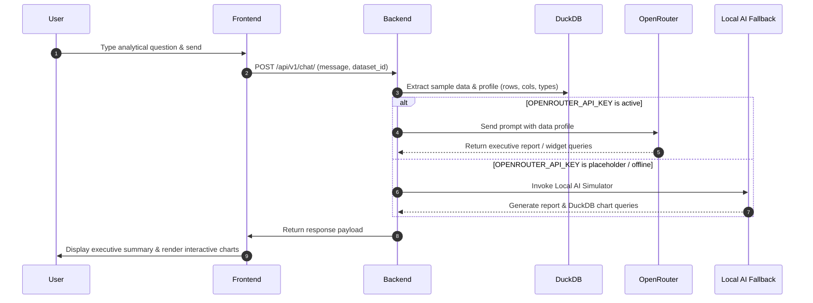

# Chai Analysis Application — Comprehensive Project Documentation

Welcome to the comprehensive documentation for the **Chai Analysis Application**. This document provides a detailed breakdown of the application's features, architectural design, technology stack, directory structure, machine learning engines, and execution flow.

---

## 📌 Table of Contents
1. [System Architecture Overview](#1-system-architecture-overview)
2. [Key Capabilities & Core Features](#2-key-capabilities--core-features)
3. [Technology Stack & Dependencies](#3-technology-stack--dependencies)
4. [Project Directory & Module Structure](#4-project-directory--module-structure)
5. [Detailed Component Architecture](#5-detailed-component-architecture)
   - [A. Data Ingestion & SQL execution](#a-data-ingestion--sql-execution)
   - [B. AI Chat & Local AI Simulator](#b-ai-chat--local-ai-simulator)
   - [C. Predictive Machine Learning Engines](#c-predictive-machine-learning-engines)
   - [D. Multi-Tenant Scoping & Security](#d-multi-tenant-scoping--security)
6. [Getting Started & Configuration](#6-getting-started--configuration)

---

## 1. System Architecture Overview

Chai Analysis is a modern, containerized, multi-tenant Business Intelligence (BI) and AI Data Analyst application. It enables users to upload datasets (CSV, Excel), query data with natural language or raw SQL, build customized dashboards, and run advanced machine learning analyses (forecasting, anomaly detection, cluster segmentation).

The architecture is composed of a **FastAPI backend API**, a **Next.js React frontend client**, a **PostgreSQL relational database** for application state and layouts, and **Redis** for session management and caching.

### System Components Diagram


---

## 2. Key Capabilities & Core Features

### 📊 Interactive Dashboard Workspace
- **Custom Widget Grid**: Drag, resize, configure, and align analytical widgets.
- **Power BI Visual Styles**: Premium visual options including standard cards, glassmorphism templates, sleek dark modes, border-radius controls, and custom gradients.
- **Focus Mode**: Click on any widget to open a high-resolution, full-screen interactive modal containing deep analytical data tables and detailed chart representations.
- **Auto-layout Recommendations**: Instantly generates dashboard pages using AI recommendations based on dataset properties.

### 💬 AI Chat Assistant & Local AI Simulator
- **Natural Language Analysis**: Ask questions like *"what is the average sales value?"* or *"show postcode performance"* to receive a text summary and suggested charts.
- **Local AI Simulator**: Operates 100% offline. If no `OPENROUTER_API_KEY` is present, it uses a built-in statistical engine and DuckDB query writer to profile columns and recommend a rich layout of widgets and charts without crashing.
- **Context Preservation**: Maintains a history of conversation logs per session.

### 🔍 Safe SQL Data Explorer
- **Read-only Environment**: Write and test PostgreSQL/DuckDB SQL commands directly against the dataset in a secure sandbox that blocks data-modifying queries.
- **Table Results & Chart Renderer**: Renders output datasets inside reactive tables and maps them to custom chart visualizations.
- **AI Query Explainer & Debugger**: Automatically explains complex SQL queries or suggests query fixes for runtime execution errors.

### 📁 Dataset Management
- **File Upload**: Handles multi-column CSV, XLS, and XLSX datasets.
- **Data Profiling**: Calculates row/column counts, columns, missing values, duplicates, and auto-rates the file's overall data quality score.
- **Schema Mapping**: Translates raw fields to column types (Numerical, Categorical, Datetime).

### 🔮 Predictive ML Analytics Studio
- **Time-series Forecasting**: Uses an Exponential Smoothing (ETS) regression model to forecast future numeric values over user-specified periods.
- **Anomaly Detection**: Uses an unsupervised Isolation Forest algorithm (contamination rate = 5%) to flag spikes or unusual transactional records.
- **Cluster Segmentation**: Uses a K-Means clustering algorithm to group records into segments based on selected features. Incorporates automated `LabelEncoder` scaling for categorical string fields and displays a detailed distribution summary.

---

## 3. Technology Stack & Dependencies

### Frontend (Client-side)
* **Framework**: React 18, Next.js 14 (App Router).
* **Styling**: Vanilla CSS + Tailwind CSS (styling configurations).
* **State Management**: Zustand (lightweight reactive client stores).
* **Charts**: Recharts (fully interactive, SVG-based charts).
* **Icons**: Lucide React.
* **Component Primitives**: Radix UI (accessible select dropdowns, modals, tabs).

### Backend (Server-side)
* **Framework**: FastAPI (Asynchronous Python API server).
* **SQL Query Execution**: DuckDB (vectorized SQL execution engine specifically suited for reading CSV/Excel files instantly).
* **Database Access**: SQLAlchemy (async session ORM) + Asyncpg driver.
* **Data Processing**: Pandas + Numpy.
* **Machine Learning**: Scikit-Learn (Isolation Forest, KMeans, LabelEncoder) + Statsmodels (ETS Exponential Smoothing).
* **Logger**: Structlog (structured JSON logger).

### Infrastructure & Orchestration
* **System Orchestrator**: Docker Compose.
* **Metadata Database**: PostgreSQL 16 (stores dashboards, logs, datasets, users).
* **Key-Value Store**: Redis (handles session data).

---

## 4. Project Directory & Module Structure

```text
Chai_Analysis/
├── docker-compose.yml     # Orchestrates DB, Redis, Backend, and Frontend containers
├── .env.example           # Configuration template file
│
├── backend/
│   ├── app/
│   │   ├── api/
│   │   │   ├── deps.py    # FastAPI dependencies (Auth verification, database session providers)
│   │   │   └── routes/    # API Endpoint Routers
│   │   │       ├── auth.py        # Login, registration, token generation
│   │   │       ├── chat.py        # Conversations & AI Chat assistant
│   │   │       ├── dashboards.py  # Dashboard creation, layouts, and widget grids
│   │   │       ├── data.py        # SQL Data Explorer queries, explainer, debugger
│   │   │       ├── datasets.py    # CSV/Excel parsing and metadata uploading
│   │   │       ├── ml.py          # Predictive ML Studio entrypoint
│   │   │       ├── settings.py    # Client API Key storage
│   │   │       └── users.py       # Profiles management
│   │   │
│   │   ├── core/
│   │   │   ├── config.py  # Pydantic global settings (CORS, URLs, API keys)
│   │   │   ├── database.py# Async database engine connection pool
│   │   │   └── security.py# Password hashing and JWT generation
│   │   │
│   │   ├── models/        # SQLAlchemy Database Schema Models
│   │   │   ├── tenant.py       # Multi-tenant organization scopes
│   │   │   ├── user.py         # User account entities
│   │   │   ├── dataset.py      # Uploaded dataset file records
│   │   │   ├── conversation.py # AI assistant chats and messages
│   │   │   ├── dashboard.py    # Interactive dashboard layout configurations
│   │   │   └── audit.py        # Security logs
│   │   │
│   │   ├── services/      # Business & Machine Learning logic
│   │   │   ├── analysis_service.py # Report generators and Local AI Simulator
│   │   │   ├── ml_service.py       # Forecasting, Anomalies, K-Means Clustering
│   │   │   ├── nl_to_sql.py        # Converts Natural Language text to SQL queries
│   │   │   └── llm_service.py      # OpenRouter API wrapper & fallbacks
│   │   │
│   │   ├── tools/
│   │   │   └── sql_executor.py # DuckDB executor for secure CSV/Excel queries
│   │   │
│   │   └── main.py        # FastAPI app launcher and exception handling
│   │
│   ├── Dockerfile
│   └── requirements.txt
│
└── frontend/
    ├── src/
    │   ├── app/           # Next.js App Router Page components
    │   │   ├── (app)/     # Authenticated Page Views
    │   │   │   ├── chat/           # AI Chat Panel
    │   │   │   ├── dashboards/     # Drag & Drop Dashboard Grid
    │   │   │   ├── data-explorer/  # SQL Terminal & Visualizer
    │   │   │   ├── datasets/       # Ingest & Upload UI
    │   │   │   └── predictive-ml/  # ML Studio options
    │   │   ├── login/     # Login interface
    │   │   └── layout.tsx # Root layout configuration
    │   │
    │   ├── components/    # Reusable UI component modules
    │   │   ├── ui/        # Shadcn button, dialog, dropdown, tab primitives
    │   │   ├── charts/    # Recharts wrappers (Bar, Line, Donut, Card)
    │   │   ├── dashboard/ # Styling customizers, widget controls, grids
    │   │   └── sql/       # SQL terminal execution tables
    │   │
    │   ├── stores/        # Zustand state models
    │   │   └── auth.ts    # Authentication token validation store
    │   │
    │   ├── hooks/         # Custom React hook utilities
    │   ├── lib/           # Utility files (Tailwind merges, axios fetchers)
    │   └── types/         # Typescript entity declarations
    │
    ├── Dockerfile
    └── package.json
```

---

## 5. Detailed Component Architecture

### A. Data Ingestion & SQL Execution
When a user uploads a CSV or Excel file, it is saved under the tenant's context in the backend. DuckDB queries this file directly using Python data frames.

For SQL execution in the Data Explorer, the query is passed to `sql_executor.py` which mounts the CSV as a virtual table named `dataset` in an isolated DuckDB memory instance:
1. Regex validations verify that only `SELECT` operations are allowed.
2. The DuckDB query runs: `SELECT * FROM "dataset_xxxx" LIMIT ...`
3. Results are returned as a JSON array of records to render on the client-side.

### B. AI Chat & Local AI Simulator
When a message is received on `/api/v1/chat/`, the backend resolves how to answer:


- **LLM Mode**: Uses the designated OpenRouter endpoint to generate complex SQL queries and summary text.
- **Local AI Simulator Mode**:
  1. Computes descriptive statistics (numeric aggregations, value counts, missing values).
  2. Compiles a comprehensive 10-heading Markdown report locally (Dataset Overview, Key Insights, Recommended KPIs, Sentiment Analysis, Visualizations, AI Action Plans, Predictive Insights).
  3. Generates simulated custom charts using valid DuckDB SQL matching the uploaded column names so the dashboard page renders immediately without crashing.

### C. Predictive Machine Learning Engines
Predictive actions are handled inside `ml_service.py`:
1. **Time-series Forecasting**:
   - Resamples timestamps daily.
   - Evaluates trends using an Exponential Smoothing (ETS) model.
   - Falls back to rolling average regressions if data points are sparse.
2. **Anomaly Detection**:
   - Standardizes daily values.
   - Fits an Isolation Forest model to detect outliers (contamination rate = 5%).
   - Flags anomalies on specific timestamps.
3. **K-Means Cluster Segmentation**:
   - Dynamically parses features.
   - Detects and converts categorical string columns using `LabelEncoder`.
   - Scales numeric variables using `StandardScaler`.
   - Runs K-Means clustering.
   - Computes centroids and cluster distribution summaries to map user personas or categories.

### D. Multi-Tenant Scoping & Security
- **Tenant Context**: All dataset tables, conversations, dashboards, and audit logs are bound to a `tenant_id` UUID.
- **Role Validation**: Authentication is scoped to active JWT tokens.
- **CORS Safeguard**: Manual CORS headers are injected during exception states in `backend/app/main.py` to prevent the browser from blocking error responses from the API.

---

## 6. Getting Started & Configuration

### Quick Start with Docker
```powershell
# 1. Copy the environment template
cp .env.example .env

# 2. Spin up the orchestrator stack
docker compose up --build -d
```
Once initialized:
* **Frontend UI**: http://localhost:4000
* **Backend API Docs**: http://localhost:8000/api/docs
* **Database Connection Port**: `5433` (Postgres)

---
*Developed with premium styling and isolated, secure multi-tenant structures.*
